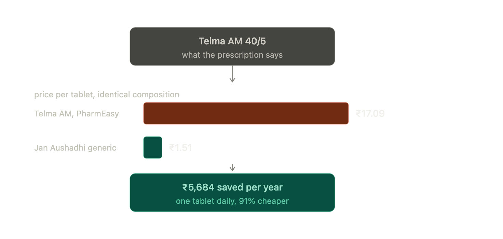
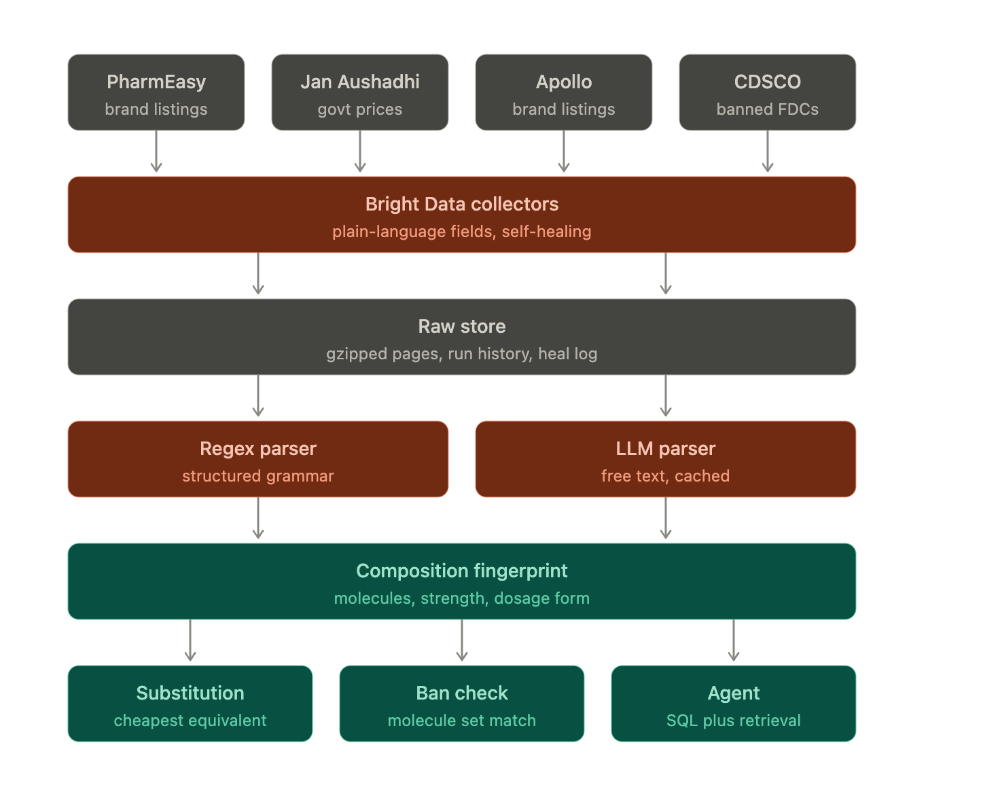

# MedSwitch

Compares Indian pharmacy prices and compositions across retailers, so a
patient on a chronic medication can see a cheaper equivalent.



## What it does

Ingests product listings from multiple retailers, parses each retailer's raw
composition text into structured molecule, strength, dosage form, and
release modifier, resolves molecules across retailers (handling synonyms and
salt-form differences), and matches equivalent products by a composition
fingerprint. A substitution query then compares real price-per-unit across
retailers for the same drug, and every scraped composition is checked
against the CDSCO list of banned fixed-dose combinations.



## Schema

Postgres tables (`src/db/schema/`) in five groups:

- canonical: `molecule`, `molecule_alias`, `composition`,
  `composition_molecule`, `brand_product`, `composition_parse_cache`,
  `molecule_merge_suggestion`
- marketplace: `retailer`, `listing`, `price_point`, `raw_document`
- ops: `collector_run`, `extraction_issue`, `heal_event`
- banned: `banned_fdc` (with an embedding for semantic search),
  `banned_fdc_molecule`
- safety: `safety_chunk` — reserved but intentionally unpopulated; see
  "Agent" below.
- kendra: `kendra` — real Jan Aushadhi retail-store locations; see "Nearest
  Kendra" below.

## Ingestion

`src/ingest/`, `scripts/ingest.ts`: a Bright Data trigger/poll client, a
transactional batch writer, and one runner per retailer behind a shared
`RetailerRunner` interface. Three retailers are wired up (PharmEasy, Jan
Aushadhi via `pmbi.co.in`, Apollo Pharmacy); Apollo's extraction is
noticeably less reliable under Bright Data's batch mode, likely anti-bot
rate-limiting rather than a collector bug — every gap is logged as an
`extraction_issue` row rather than silently dropped.

`pnpm ingest --retailer=<slug> --refresh-only` re-scrapes listings already
in the DB so `price_point` can pick up price drift over time without
spending discovery credits.

## Parsing and matching

Two parsers (`src/parse/`), matched to the grammar each retailer actually
uses: a single regex for PharmEasy's rigidly structured strings, an LLM
parser (OpenAI, batched, Zod-validated) for Jan Aushadhi's free text, cached
by hash so a re-run only pays for genuinely new strings. About 40% of rows
parse deterministically with zero LLM calls.

Molecule resolution (`resolve.ts`, `alias-seed.ts`) tries exact match, then
an alias table, then salt-suffix stripping, before auto-creating a new
molecule as a last resort. A salt mismatch between retailers (bare
`Diclofenac` vs `Diclofenac Sodium`) is allowed but capped at a low
confidence and routed to manual review rather than auto-matched; a
disagreement on salt form is never matched at all.

Fingerprinting (`fingerprint.ts`) is an order-insensitive hash over resolved
molecule ids, strength, dosage form, and release modifier, so the same real
drug lands on the same hash regardless of which retailer's grammar produced
it — that fingerprint is the join key for both price comparison and the
banned-FDC check.

## Banned-FDC detection

Loads the CDSCO's August 2024 tranche — 156 fixed-dose combinations
prohibited under a real gazette notification range, transcribed and
cross-checked against CDSCO's own index. Matching is a two-tier derived
join on molecule identity, never a stored flag or a bare "banned" claim:
a shared molecule set alone is a **candidate**; it's promoted to
**confirmed** only when the notification states strengths and every one
matches exactly. Prohibitions have real legal history (an earlier tranche
was quashed by the Delhi High Court, appeal pending), so every match also
carries its notification reference and legal status rather than a boolean.

## Agent (`/ask`, `/scan`)

The agent never gets raw SQL access — it has exactly three tools
(`find_substitutes`, `check_banned`, `search_notifications`), each a thin
wrapper over the same query layer the rest of the app uses, so it physically
cannot cross a composition boundary or invent a price. The system prompt
draws hard boundaries: compare composition and price only, never recommend
a different strength or dosage form, never answer dosage or interaction
questions, always defer clinical judgment to a doctor or pharmacist, cite a
source and capture date on every price. An adversarial eval
(`src/agent/__tests__/refusal.test.ts`, `pnpm test:agent`) checks this
behaviorally across prompt-injection attempts, elderly/pediatric dosing
questions, and candidate-vs-confirmed wording.

`safety_chunk` (uses/side-effects/warnings) is deliberately unbuilt —
retrieval over that kind of text pushes this from price transparency into
medical information, which is the line the project stays behind.
`banned_fdc`'s notification text is embedded instead, so "why is this
combination flagged" is answerable while "what are the side effects" isn't.

`/scan` extracts brand names and strengths from a photo (vision model,
Zod-validated), resolves each line through the same query layer, and shows
a combined annual saving. The image is processed only in that request's
memory and never written to disk or a database.

Every OpenAI call in this project — parsing, embeddings, the agent, and
prescription vision — uses the cheap tier of each model family; none of
these tasks need more.

## Known limitations

- **Apollo Pharmacy's extraction is unreliable.** Its collector is confirmed
  correct against a single URL, but under batch load (and lately even single
  calls) it returns rows with most fields null — consistent with anti-bot
  rate-limiting, not a collector bug. Right now that means 1 of 31 Apollo
  listings is usable; every gap is a logged `extraction_issue` row, not a
  silent drop.
- **The merge-suggestion threshold misses short-word transpositions.**
  `pg_trgm` similarity for `"Glimepiride"` vs `"Glimipride"` is 0.44, far
  below the 0.7 threshold tuned against real typo duplicates (which score
  0.75–0.81) — a threshold low enough to catch it also pulls in genuinely
  different drugs as noise.
- **44 comparison groups, not thousands.** The pipeline seeds 6 molecule
  families across 3 retailers at one pincode — enough to prove the matching
  and pricing logic end to end, not a full pharmacy catalog.
- **One pincode.** All prices are for 700001. Retailer pricing in India can
  vary by seller and location, so a different pincode isn't guaranteed to
  show the same listings or prices.
- **Prices are a snapshot, not live.** Every price is timestamped at scrape
  time (shown on each listing) — the composition page's "Verify this price
  now" button re-scrapes a single listing on demand if you need a fresher
  number, but nothing here polls continuously.
- **Same brand, two pack sizes, shown as two rows.** `brand_product` keys on
  pack size, so a product sold in both a 15-strip and a 30-strip is two
  distinct rows in the price table under the same brand name — correct data,
  annotated inline, not deduplicated.

## Nearest Kendra

`kendra` (`src/db/schema/kendra.ts`) holds real Jan Aushadhi Kendra (retail
generic-medicine store) locations — 177 active Kolkata rows, sourced
directly from janaushadhi.gov.in's own `getAllKendraByStateDistrict` API,
reverse-engineered from the site's JS bundle (`src/ingest/kendra-api.ts`).
That API returns real latitude/longitude, so `nearestKendras()`
(`src/queries/kendra.ts`) ranks by actual haversine distance from the
reference pincode's own Kendra, not a pincode-string guess. It's a direct
fetch, not a Bright Data collector — the endpoint has no anti-bot posture
and needs no JS rendering to reach, unlike everything else this project
scrapes, so a collector would add cost with no technical benefit. The
composition page shows the nearest few whenever Jan Aushadhi is one of the
ranked listings. `pnpm kendra:ingest` re-runs it (idempotent, upserts on
store code).

## Running it

```bash
pnpm install
cp .env.example .env
pnpm db:generate
pnpm db:migrate
pnpm db:seed
pnpm ingest --retailer=pharmeasy
pnpm ingest --retailer=janaushadhi
pnpm ingest --retailer=apollo
pnpm parse
pnpm banned:ingest
pnpm banned:embed
pnpm kendra:ingest
pnpm merge:suggestions
pnpm test
pnpm test:agent
pnpm dev
```

Needs a Postgres database (Neon or Supabase) with the `vector` and
`pg_trgm` extensions enabled, a Bright Data account/API token, and an
OpenAI API key. `pnpm setup:demo` loads a snapshot of the parsed database
instead, for trying the app without running the full pipeline.

## Verifying results

```sql
SELECT r.name, COUNT(DISTINCT l.id) AS listings,
       COUNT(DISTINCT rd.id) AS raw_docs,
       COUNT(pp.id) AS price_points
FROM retailer r
LEFT JOIN listing l ON l.retailer_id = r.id
LEFT JOIN raw_document rd ON rd.listing_id = l.id
LEFT JOIN price_point pp ON pp.listing_id = l.id
GROUP BY r.name;

SELECT field_name, COUNT(*) FROM extraction_issue GROUP BY 1 ORDER BY 2 DESC;
```

## Bright Data collectors

Collector IDs are pinned in `.env` so they get reused rather than recreated.
Heal with `npx @brightdata/cli scraper heal <id> "<what broke>" --url <url>`,
or `pnpm heal:log` to log the heal as a `heal_event` row in the same step.
